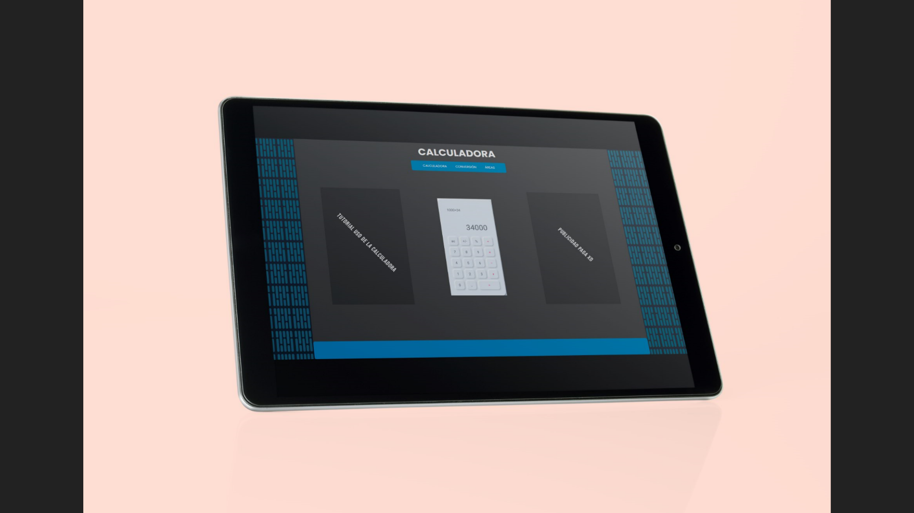
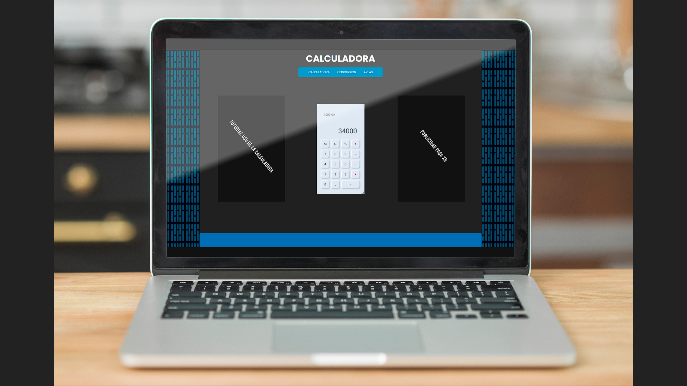

# <center> Plan de negocio</center>

## <center> Daniel Cardenas </center>

## <center>Johan Lozano </center>

## <center> Christian Martinez </center>

## <center> Angel Cruz </center>

## <center> Politecnico internacional</center>

# Tabla de contenido
  - [Introducción](#introduccion)
  - [Reglas de negocio](#reglas-de-negocio)
  - [Requerimientos](#requerimientos)
    - [Levantamiento de requerimientos](#levantamiento-de-requerimientos)
    - [Analisis de requerimientos](#analisis-de-requerimientos)
      - [Diagrama de casos](#diagrama-de-casos)
  - [Diseño de requerimientos](#diseño-de-requerimientos)
  - [Desarrollo](#desarrollo)
  - [Pruebas](#pruebas)
  - [Implementación](#implementacion)
  - [Mantenimiento](#mantenimiento)
 

## Introducción
Se solicita el desarrllo de una pagina web que tenga diferentes funcionalidades, todas enfocadas a operaciones matematicas y con un diseño en particular, entre las funcinalidades esta una calculadora, un conversor de medidas que cuente con medidas internacionales todo mostrado en pantalla en tiempo real. 

La contará con licencias Creative Commons, que son de libre uso, utilizando tecnologias como lo son JavaScript,HTML 5,CSS 3,GIT y herramientas de diseño como Photoshop.

El tiempo estimado de desarrollo se establecio en 3 dias, siendo el dia uno para levantamiento de requerimiento y analasis de los mismos, y los otros dos para desarrollo y entrega al cliente para su posterior subida al repositorio de la organizacion.

Link Pagina: www.tuarea.ga

## Reglas de negocio
1. Todo cliente tiene permitido adquirir cualquier copia de la Calculadora, y a usarla para proposito personal, académico e industrial.

2. No está permitido usar la aplicación para su comercialización, a menos que se le de reconocimiento o meritos a sus desarrolladores.

3. Al ser una aplicación de código abierto, esta permitido realizar cambios pertinentes para mejorar la misma en cualquiera de sus formas.


## Requerimientos
### Levantamiento de requerimientos
  1. Fácil acceso desde <strong>*cualquier dispositivo*</strong> sin perder ninguna cualidad.
  2. Es necesarioa una calculadora con operaciones basicas para poder obtener medidas exactas en el instante que sea deseado. 
  3. Conversor de medidas tanto internacionales, como las usadas por países angroparlantes, entre otros.
  4. Un apartado de áreas para las figuras más básicas (triangulo, circulo, rectangulo, etc) para ayudar a dar sus resultados en cantidades de material con exactitud.
  
### Analisis de requerimientos
  1. Para que la aplicación sea funcional en todos los dispositivos necesitamos el uso del lenguaje JavaScrip ademas de otro tipo de herramientas como lo son CSS y   HTML, con esto se busca llegar a el punto maximo de responsive posible.
  2. Su accesibilidad no debe ser limitada por la hora del dia, por ello necesitamos un hosting.
  3. Uso de JavaScript para la funcionalidad de las partes que requieran operaciones matematicas, esto se aplica tanto a la calculadora como a los conversores de medidas y a la parte de las áreas.
## Diagrama de casos
### Areas
  ```mermaid
    graph TD;

subgraph mostrar
      m(resultado.innerHTML=resultado)
    end

    subgraph igualar
      Imp(numeroFinal+medida)
      Imp --> resultado --> m
    end

    subgraph calcular
      base[/base = base.value/]-->altura[/altura = altura.value/]
      altura --> medida[/medida = medida.value/]
      medida --> Imp
    t3{numeroFigura}
    met1(altura * altura)
    met2(base * altura/2)
    nF(numeroFinal)
    t3 --> case1 --> met1 --> nF
    t3 --> case3 --> met1 
    t3 --> case2 --> met2 --> nF
    t3 --> case4 --> met2 
    end

    subgraph noFigura
    start --> t1(numeroFigura = Function.clicked)
    t1 --> t3
    end
    


``` 
### conversor de medidas
  ```mermaid
    graph TD;
    subgraph conversion
    t3{medida1}
    t3 --> conversionCM1 -->t4
    t3 --> conversionCM2 -->t4
    t3 --> conversionCM3 -->t4
    t3 --> conversionCM4 -->t4 
    t3 --> conversionCM5 -->t4
    t3 --> conversionCM6 -->t4
    t3 --> conversionCM7 -->t4
    t3 --> conversionCM8 -->t4
    t3 --> conversionCM9 -->t4
    end
    subgraph conversionFinal
    t4--> conversionfinal1 --> mostrar
    t4--> conversionfinal2 --> mostrar
    t4--> conversionfinal3 --> mostrar
    t4--> conversionfinal4 --> mostrar
    t4--> conversionfinal5 --> mostrar
    t4--> conversionfinal6 --> mostrar
    t4--> conversionfinal7 --> mostrar
    t4--> conversionfinal8 --> mostrar
    t4--> conversionfinal9 --> mostrar
    end

    a(ingreso de datos)-->b(medida1 = document.getElementById)
    a-->c(medida2 = document.getElementById)
    a-->d(Dato1 = document.getElementById)  
```

## Diseño de requerimientos

## Desarrollo
## Pruebas
## Implementacion
## Mantenimiento
## Mockup
  1. 
  2. 

## Legal

   
   <strong> Atribución – No comercial – Compartir:</strong> Están permitidos, otros a distribuir, remezclar, retocar, y crear a partir de tu obra de modo no comercial, siempre y cuando te den crédito y licencien sus nuevas creaciones bajo las mismas condiciones.
   
### Licenia de Terceros
#### Licencia de fuente 
  1. Poppins: [Open Font Licens](https://fonts.google.com/specimen/Poppins?query=POPPINS&preview.text_type=custom&selection.family=Poppins:wght@500)
#### Licencia de teconologias
  1. jquery: [MIT License](https://github.com/jquery/jquery) 
  2. JavaScript: [LibreJS](https://www.gnu.org/software/librejs/index.html)
   


   


